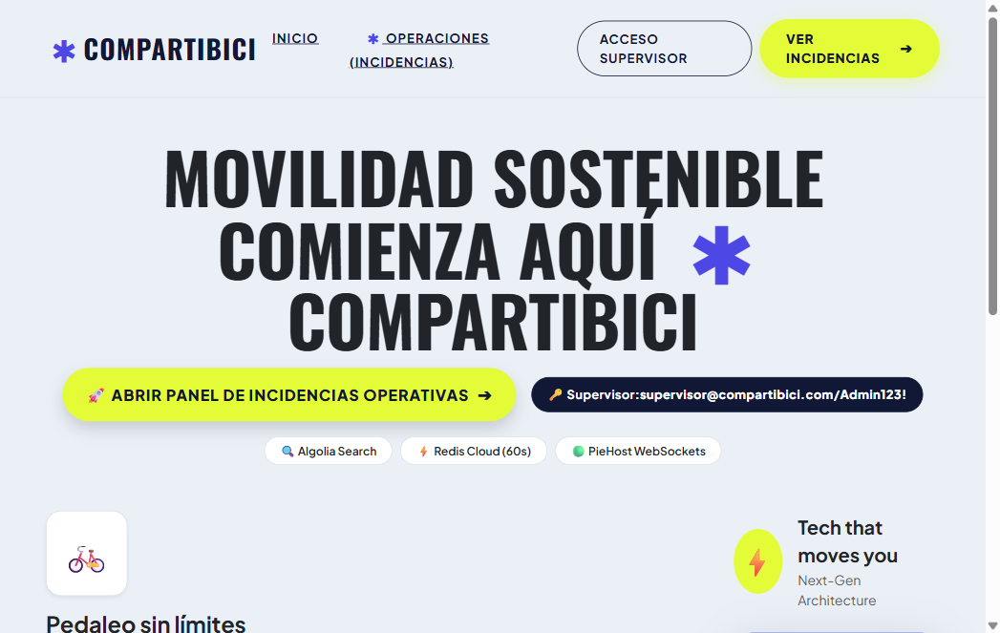
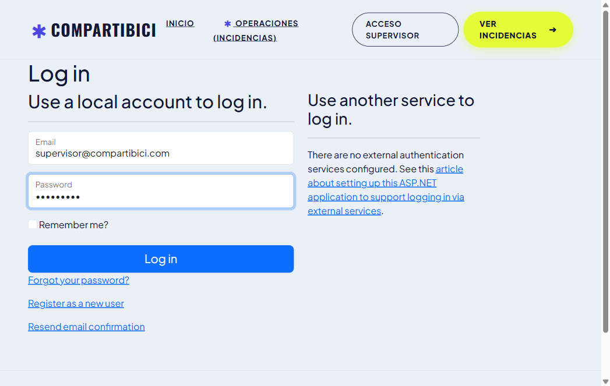
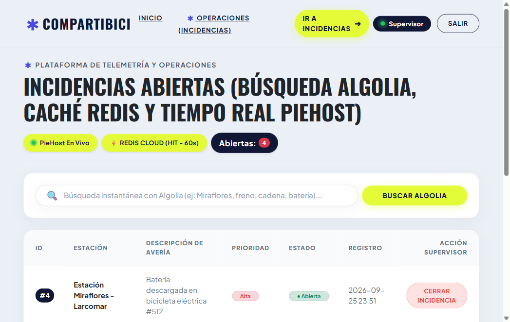
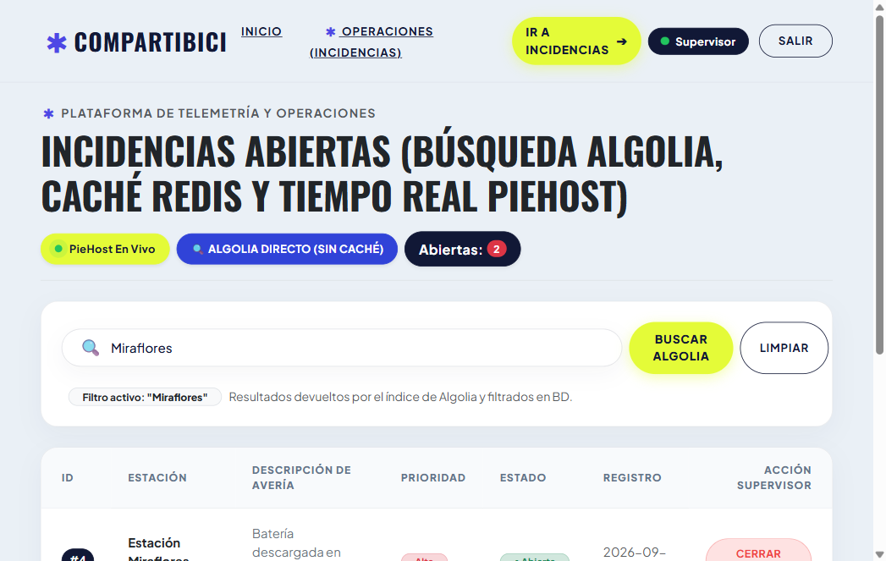
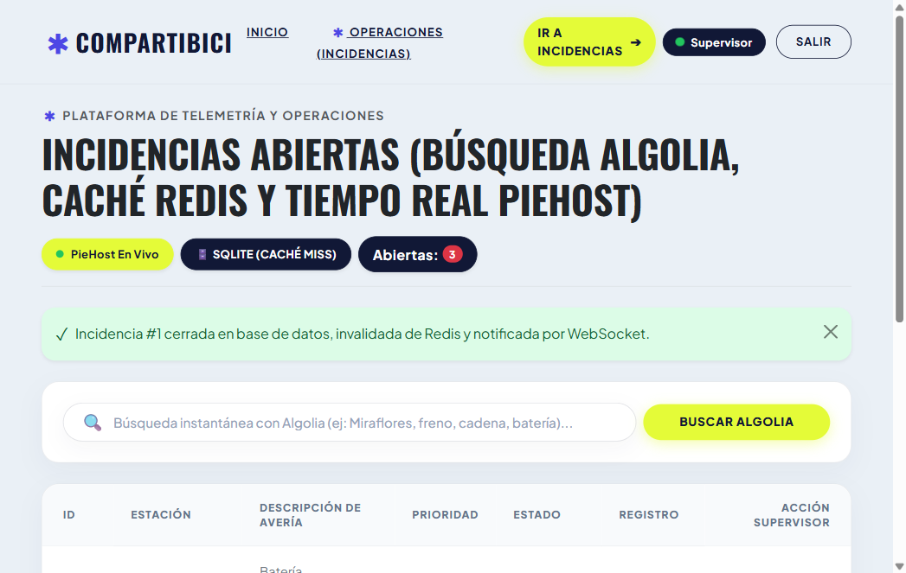

# 🚲 Plataforma de Incidencias Operativas - CompartiBici
**Examen Parcial: Arquitectura de Servicios Distribuidos, Control de Versiones Git y Despliegue en Render**

---

## 📌 1. Información General del Proyecto
* **Repositorio GitHub:** [https://github.com/gerfhy/compartibici](https://github.com/gerfhy/compartibici)
* **URL Pública en Producción (Render):** [https://compartibici.onrender.com/](https://compartibici.onrender.com/)
* **Stack Tecnológico:** ASP.NET Core (.NET 10) + EF Core SQLite + ASP.NET Identity con Roles
* **Servicios Distribuidos Integrados:**
  1. **Algolia Search:** Búsqueda en servidor sobre índice `incidencias` con filtrado de registros abiertos en base de datos.
  2. **Redis Cloud:** Caché distribuida de 60 segundos con invalidación reactiva tras el cierre de incidencias y telemetría de `CACHE HIT` / `CACHE MISS`.
  3. **PieHost (PieSocket WebSockets):** Transmisión de eventos `IncidenciaActualizada` en tiempo real tras la persistencia en base de datos, con actualización reactiva sin recargar la página y sincronización al reconectar.
* **Infraestructura de Despliegue:** Render.com (Web Service Dockerizado con disco persistente `/var/data` para SQLite).

---

## 🔐 2. Credenciales del Sistema y Usuario Supervisor
| Rol / Acceso | Usuario / Identificador | Contraseña / Clave |
| :--- | :--- | :--- |
| **Supervisor Operaciones** | `supervisor@compartibici.com` | `Admin123!` |
| **Ruta del Panel Operativo** | `/Operaciones/Incidencias` | Acceso con rol Supervisor |

---

## 🌿 3. Control de Versiones: Ramas, Pull Requests y Resolución de Conflictos

### A. Ramas y Pull Requests Independientes
Todas las ramas (`feature/busqueda-algolia`, `feature/cache-redis`, `feature/websocket-piehost`) nacieron del **mismo commit inicial de `main`** (`1a4cb63`) sin trabajo directo sobre `main`.

| Pregunta / Feature | Rama de Desarrollo | Enlace de Pull Request | Commit de Implementación |
| :--- | :--- | :--- | :--- |
| **Pregunta 1: Búsqueda Algolia** | `feature/busqueda-algolia` | [Abrir / Ver PR #1](https://github.com/gerfhy/compartibici/pull/new/feature/busqueda-algolia) | `b80df54` |
| **Pregunta 2: Caché Redis** | `feature/cache-redis` | [Abrir / Ver PR #2](https://github.com/gerfhy/compartibici/pull/new/feature/cache-redis) | `3c0ee1c` |
| **Pregunta 3: WebSocket PieHost** | `feature/websocket-piehost` | [Abrir / Ver PR #3](https://github.com/gerfhy/compartibici/pull/new/feature/websocket-piehost) | `122d41e` |

---

### B. Historial de Git (`git log --graph --oneline --all`)
```text
*   5eaa572 Merge pull request #3 from gerfhy/feature/websocket-piehost
|\  
| *   6f5160f Merge branch 'main' into feature/websocket-piehost: resolver conflicto integrando busqueda Algolia, cache Redis y tiempo real PieHost
| |\  
| |/  
|/|   
* |   e081681 Merge pull request #2 from gerfhy/feature/cache-redis
|\ \  
| * \   77e6beb Merge branch 'main' into feature/cache-redis: resolver conflicto integrando busqueda Algolia y cache Redis
| |\ \  
| |/ /  
|/| |   
* | |   a1be076 Merge pull request #1 from gerfhy/feature/busqueda-algolia
|\ \ \  
| * | | b80df54 feat(pregunta-1): busqueda de incidencias con algolia y filtrado de abiertas
|/ / /  
| * / 3c0ee1c feat(pregunta-2): implementacion de cache distribuida con redis por 60s e invalidacion reactiva
|/ /  
| * 122d41e feat(pregunta-3): sincronizacion en tiempo real con websockets de piehost y actualizacion sin recarga
|/  
* 1a4cb63 feat: proyecto base de plataforma de incidencias con SQLite e Identity
```

---

### C. Explicación Técnica de las Resoluciones de Conflicto

#### 1. Primer Conflicto: Fusión de `main` en `feature/cache-redis` (Commit `77e6beb`)
* **Línea en conflicto (Título compartido en `Incidencias.cshtml`):**
  * `main` traía: `<h1>Incidencias abiertas encontradas</h1>` (Algolia)
  * `feature/cache-redis` tenía: `<h1>Incidencias abiertas con consulta rápida</h1>` (Redis)
  * **Resolución:** Se unificó a `<h1>Incidencias abiertas encontradas con consulta rápida</h1>`.
* **Conflicto en `Controllers/OperacionesController.cs`:**
  * Se respetó la regla: *«La búsqueda con texto de Algolia se consultará directamente, sin usar esta caché»*. Si `q` contiene texto, se consulta Algolia de forma directa sin Redis; si `q` es vacío, se consulta el listado general cacheado por 60 segundos en Redis.
* **Conflicto en `Program.cs`:** Se mantuvieron registrados ambos servicios (`IAlgoliaSearchService` y `AddStackExchangeRedisCache`).

#### 2. Segundo Conflicto: Fusión de `main` en `feature/websocket-piehost` (Commit `6f5160f`)
* **Línea en conflicto (Título compartido en `Incidencias.cshtml`):**
  * `main` traía: `<h1>Incidencias abiertas encontradas con consulta rápida</h1>` (Algolia + Redis)
  * `feature/websocket-piehost` tenía: `<h1>Incidencias abiertas en tiempo real</h1>` (PieHost)
  * **Resolución:** Se unificó a `<h1>Incidencias abiertas (Búsqueda Algolia, Caché Redis y Tiempo Real PieHost)</h1>`.
* **Conflicto en `Controllers/OperacionesController.cs` (Secuencia Estricta de Cierre):**
  * Se implementó rigurosamente la secuencia requerida por la rúbrica:
    1. **Persistencia:** Actualizar estado en la base de datos SQLite (`Estado = "Cerrada"`).
    2. **Invalidación:** Remover la clave del listado general en Redis (`_cache.RemoveAsync("incidencias_abiertas_listado")`).
    3. **Notificación:** Publicar evento `IncidenciaActualizada` con `Id` y `Estado` en el canal de PieHost.
  * **Garantía Algolia:** Al persistir el estado cerrado en base de datos, el filtro del servidor descarta automáticamente registros cerrados, impidiendo que vuelvan a aparecer en búsquedas futuras.
* **Conflicto en `Program.cs`:** Se inyectaron todos los servicios concurrentemente sin duplicaciones.

---

## ⚡ 4. Servicios Configurados y Variables de Entorno

### Plantilla de Variables de Entorno para Producción (Render Dashboard)
```env
ASPNETCORE_ENVIRONMENT=Production
ConnectionStrings__DefaultConnection=Data Source=/var/data/app.db
Redis__ConnectionString=redis://default:<PASSWORD>@<HOST>:<PORT>
PieSocket__ClusterId=<CLUSTER_ID>
PieSocket__ApiKey=<API_KEY>
PieSocket__Secret=<SECRET>
PieSocket__RoomId=incidencias_canal
Algolia__ApplicationId=<APP_ID>
Algolia__SearchApiKey=<SEARCH_API_KEY>
Algolia__ApiKey=<SEARCH_API_KEY>
Algolia__WriteApiKey=<WRITE_API_KEY>
Algolia__IndexName=incidencias
```

---

## 🧪 5. Guía de Pruebas y Evidencia de Evaluación en Render

**URL del Despliegue en Vivo:** [https://compartibici.onrender.com/](https://compartibici.onrender.com/)  
**Credenciales de Supervisor:** `supervisor@compartibici.com` / `Admin123!`

### 📸 Evidencia Visual de Ejecución en Vivo

#### 1. Portada y Experiencia de Usuario (Rediseño Aerion)
* **Ruta:** `/`
* Acceso directo para evaluadores y supervisores con indicadores de servicios activos (Algolia, Redis Cloud y PieHost).


#### 2. Autenticación Segura de Supervisor
* **Ruta:** `/Identity/Account/Login?returnUrl=%2FOperaciones%2FIncidencias`
* Flujo de autenticación que redirige de inmediato al centro operativo sin pantallas intermedias confusas.


#### 3. Caché de Alto Rendimiento con Redis Cloud
* **Ruta:** `/Operaciones/Incidencias`
* Al cargar por segunda vez dentro del TTL de 60 segundos, se comprueba el `⚡ REDIS CLOUD (HIT - 60s)` y el indicador activo `🟢 PieHost En Vivo`.


#### 4. Búsqueda Instantánea con Algolia (Pregunta 1)
* **Ruta:** `/Operaciones/Incidencias?q=Miraflores`
* La consulta busca en el índice de Algolia, mostrando la insignia `🔍 ALGOLIA DIRECTO (SIN CACHÉ)` y filtrando exclusivamente las averías abiertas coincidentes.


#### 5. Cierre de Avería, Invalidación de Caché y WebSocket PieHost (Preguntas 2 y 3)
* **Ruta:** `/Operaciones/Incidencias`
* Al pulsar **Cerrar Incidencia**:
  1. Se actualiza el estado en SQLite (`Estado = Cerrada`).
  2. Se invalida la clave en Redis (`🗄️ SQLITE (CACHÉ MISS)` al regenerarse la lista).
  3. Se emite evento en tiempo real vía WebSocket con PieHost (`🟢 PieHost En Vivo`), reduciendo el contador y notificando la acción.


---

## 🚀 6. Despliegue en Render (Pregunta 5)
1. Conectar el repositorio `https://github.com/gerfhy/compartibici` en Render.
2. Crear un **Web Service** seleccionando **Docker**.
3. Agregar un disco persistente montado en `/var/data` (1 GB) para persistencia SQLite.
4. Configurar las variables de entorno detalladas en el panel seguro de Render.
5. El servicio compila automáticamente mediante el `Dockerfile` optimizado para .NET 10 y expone el puerto `$PORT` asignado dinámicamente.

